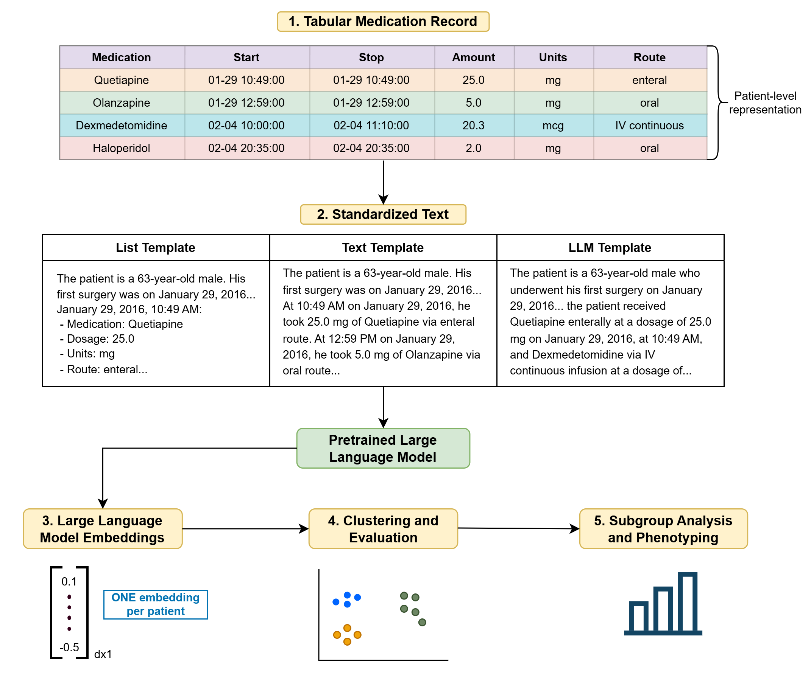

# MEDLEY Code Repository

This repository contains code for the MEDLEY framework described in "Medication-use phenotypes from large language model embeddings identify distinct postoperative recovery trajectories." 

The MEDLEY framework builds perioperative medication histories from MIMIC-IV, transforms tabular medication histories into standardized clinical narratives, generates large language model embeddings, clusters patient-level representations, and produces the manuscript tables and scripted figure outputs.



Figure 1. Overview of the MEDLEY framework.

The code is organized around two applications:

- POD: postoperative delirium medication histories among ICU surgery patients with positive CAM-ICU assessments.
- PONV: postoperative nausea and vomiting medication histories among in-hospital surgical patients with a clearly defined perioperative window spanning from one day before surgery to four days after surgery. 

The datasets used in both case studies were derived from the Medical Information Mart for Intensive Care (MIMIC)-IV database (version 3.1) (https://physionet.org/content/mimiciv/3.1/hosp/#files-panel).

## Data Availability

MIMIC-IV data are not included in this repository. Users must obtain access to MIMIC-IV separately and provide a local SQLite path to query the database.

Database access is restricted to credentialed PhysioNet users who have completed the required human subjects training and signed the associated Data Use Agreement.

## MEDLEY Overview

MEDLEY (Medication Embeddings for Longitudinal Phenotyping) is a framework for phenotyping patients from longitudinal medication-use profiles.

The computational workflow follows the manuscript framework:

1. Extract medication administrations and cohort variables from MIMIC-IV.
2. Clean medication names, administrations, timing, routes, doses, demographics, clinical variables, and cohort identifiers.
3. Serialize tabular medication histories into list and text templates; for POD, optionally generate decoder-LLM summaries.
4. Generate patient-level encoder embeddings from the serialized medication histories.
5. Run PCA, clustering, and cluster assignment workflows.
6. Produce manuscript tables and scripted figure outputs for phenotype interpretation.

Some embedding and clustering steps are computationally intensive and are expected to run on a GPU-enabled cluster. The repository therefore includes both local Makefile targets and SLURM submission scripts.

## Quick Start

Run commands from the repository root.

1. Configure the MIMIC-IV database path.

   The default database path is `data/external/mimic4.db`. To use another location, set:

   ```bash
   export MIMICIV_DB_PATH=/path/to/mimic4.db
   ```

2. Install Python package requirements.

   Python dependencies are pinned in `requirements-python.txt`.

   ```bash
   python3 -m pip install -r requirements-python.txt
   ```

3. Install R package requirements.

   R dependencies are pinned in `requirements-r.txt`. Install them with your preferred R package manager, using the versions listed there.

4. Create expected output directories.

   ```bash
   make dirs
   ```

5. Extract source tables from MIMIC-IV.

   ```bash
   make extract
   ```

6. Download HCUP source files.

   This step downloads the Procedure Classes and clinical-domain CSV files used for surgical cohort extraction. It is also run automatically by `make surgery`, `make pod-cohort`, and `make ponv-cohort`.

   ```bash
   make hcup-source-files
   ```

7. Build cohort-level inputs and non-LLM templates.

   ```bash
   make pod-cohort
   make pod-templates
   make ponv-cohort
   make ponv-templates
   ```

8. Generate the POD decoder-LLM template.

   This step requires the user to provide a local model path or Hugging Face model identifier.

   ```bash
   make pod-llm-template LLAMA_MODEL_PATH=/path/or/huggingface-id
   ```

   The output is written to `data/llm_inputs/medications_llama3.3_template.jsonl`.

9. Run local encoder embeddings, if desired.

   ```bash
   make pod-embeddings-local LLAMA_MODEL_PATH=/path/or/huggingface-id
   make ponv-embeddings-local
   ```

10. Rebuild manuscript tables and scripted figure outputs.

   ```bash
   make manuscript
   ```

For an overview of available targets:

```bash
make help
```

## Makefile Workflows

The [Makefile](Makefile) provides the main user-facing workflow.

- `make dirs`: create expected output folders.
- `make extract`: extract MIMIC-IV source tables into `data/raw/`.
- `make hcup-source-files`: download HCUP source files into `data/external/`.
- `make surgery`: construct the shared surgical cohort files.
- `make pod-cohort`: construct the POD analysis cohort.
- `make pod-templates`: create POD list and text templates.
- `make pod-llm-template`: generate POD decoder-LLM summaries in `data/llm_inputs/`.
- `make pod-embeddings-local`: run POD encoder embeddings locally.
- `make ponv-cohort`: construct the PONV analysis cohort.
- `make ponv-templates`: create PONV list and text templates.
- `make ponv-embeddings-local`: run PONV encoder embeddings locally.
- `make submit-pod-embeddings`: submit POD embedding jobs to SLURM.
- `make submit-ponv-embeddings`: submit PONV embedding jobs to SLURM.
- `make submit-pod-clustering`: submit POD clustering jobs to SLURM.
- `make submit-ponv-clustering`: submit PONV clustering jobs to SLURM.
- `make manuscript`: rebuild manuscript tables and scripted figure outputs.
- `make submit-all-slurm`: submit heavy embedding and clustering jobs to SLURM.

The full `make reproduce` target runs extraction, HCUP source-file download, cohort construction, template generation, and manuscript outputs. It includes the POD decoder-LLM template step, so `LLAMA_MODEL_PATH` must be provided. Heavy embedding and clustering outputs should be generated locally or through the SLURM targets before rebuilding manuscript tables and figures that depend on them.

## Directory Guide

- `config/`: project configuration files, including `paths.yml`.
- `data/`: generated data products. Raw extracts, derived cohorts, LLM inputs, embeddings, logs, and clustering results are written here. POD and PONV outputs use `01_POD` and `02_PONV` subfolders where applicable.
- `figures/`: generated figure files, organized under `figures/main/` (main text figures) and `figures/clustering/` (supplementary clustering figures) with `01_POD` and `02_PONV` subfolders.
- `reports/`: scripts for summary tables and clustering reports, organized by application.
- `scripts/00_utils/`: shared R helper functions for POD and PONV analyses.
- `scripts/01_extract/`: MIMIC-IV table extraction scripts and HCUP source-file downloader.
- `scripts/02_clean/`: shared surgery cohort construction plus POD and PONV cohort construction and feature engineering in `01_POD/` and `02_PONV/`.
- `scripts/03_descriptives/`: descriptive analyses, table scripts, and manuscript figure notebooks, organized by application.
- `scripts/04_embeddings/`: POD and PONV serialization and encoder embedding scripts in `01_POD/` and `02_PONV/`.
- `scripts/05_slurm/`: SLURM submission scripts for heavier embedding and clustering jobs, organized by workflow and application.
- `scripts/06_decoder_llm/`: POD decoder-LLM template generation scripts.
- `scripts/07_clustering/`: PCA, clustering, and cluster assignment scripts in `01_POD/` and `02_PONV/`.
- `tables/`: generated manuscript and supplemental tables in `01_POD/` and `02_PONV/`.

## External Data Files 

MIMIC-IV data are not included in this repository. The HCUP source files used for surgical cohort extraction can be downloaded into `data/external/`.

The [Healthcare Cost and Utilization Project (HCUP)](https://hcup-us.ahrq.gov/databases.jsp) is a family of healthcare databases and software tools developed through AHRQ and partner organizations. This project uses HCUP procedure classification resources to identify major surgical procedures and assign broad clinical domains to procedure codes.

To download the HCUP Procedure Classes and clinical-domain files used for surgical cohort extraction, run:

```bash
make hcup-source-files
```

This target runs `scripts/01_extract/download_hcup_source_files.R`. Existing HCUP files are kept by default; run the R script directly with `--overwrite` to replace them.

Disease-specific ICD diagnosis code lists used in the analysis are defined
directly in the analysis scripts. CSV files containing ICD code descriptions
were used only for reference and are not required for reproduction.

## Configuration

Project paths are defined in `config/paths.yml`. The most important setting is the MIMIC-IV SQLite database path:

```yaml
paths:
  db: "data/external/mimic4.db"
```

R extraction scripts also respect the `MIMICIV_DB_PATH` environment variable, which is the recommended way to point the code to a local database without editing tracked files.

The POD decoder-LLM script requires a model path or Hugging Face identifier. Provide it through the Makefile variable:

```bash
make pod-llm-template LLAMA_MODEL_PATH=/path/or/huggingface-id
```

or directly to the script:

```bash
python3 scripts/06_decoder_llm/01_POD/run_llama3.3_beam_search.py --model-path /path/or/huggingface-id
```

## Software

The project uses both R and Python.

- The manuscript analyses were run with Python 3.12.4 and R 4.4.0.
- Python package requirements, including pinned versions, are listed in `requirements-python.txt`.
- GPU-based Python analyses were performed using PyTorch 2.7.1 with CUDA 12.4.
- R package requirements with pinned versions from the original computing environment are listed in `requirements-r.txt`.
- Large encoder and decoder models are not included in this repository and require GPU resources.
- SLURM scripts in `scripts/05_slurm/` are provided for cluster execution and may need local adjustment for a user's compute environment.

## Notes For Reuse

This repository is intended to be run as a reproducible code supplement, but some steps are computationally expensive. In practice, users may run cohort construction and template generation locally, then submit embedding and clustering jobs through SLURM or another GPU-enabled environment.

## License

This project is released under the MIT License.
